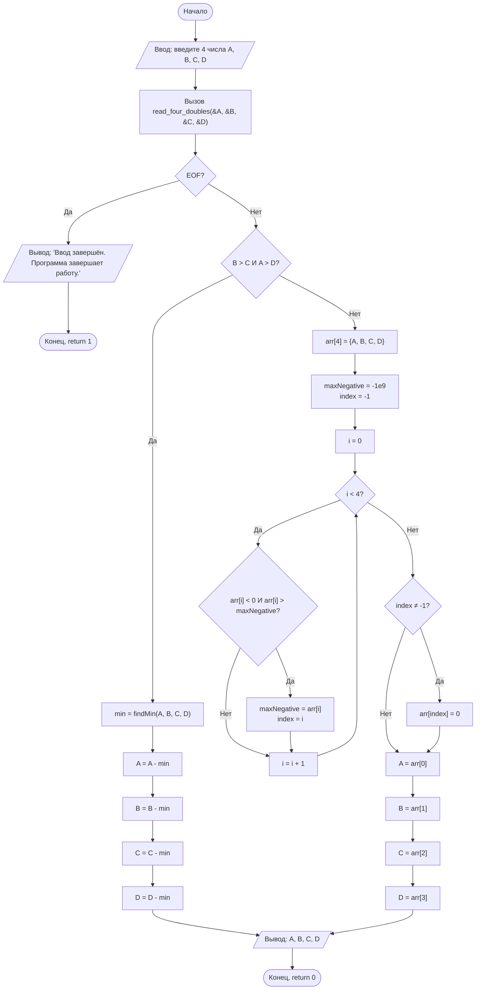
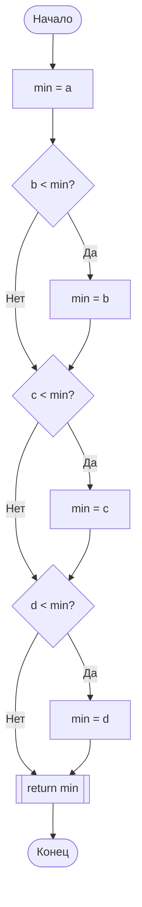
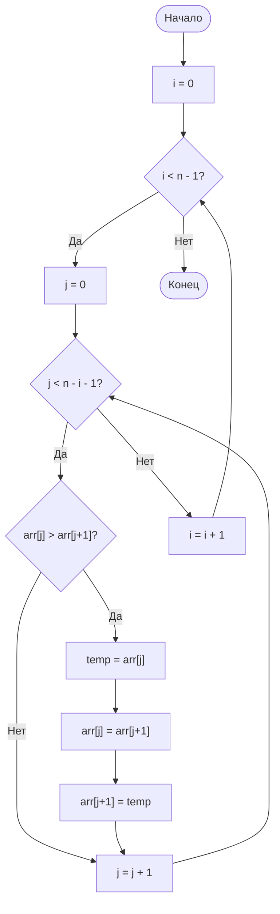
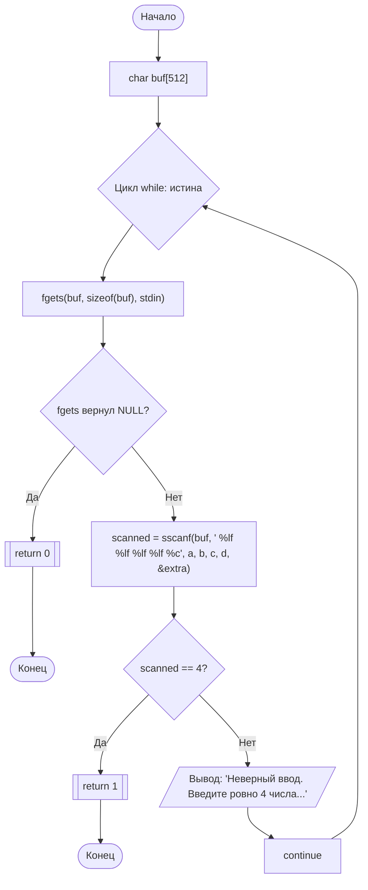

# Блок-схема программы по ГОСТ 19.701-90

## Основная программа (main)

## Функция findMin(a, b, c, d)

## Функция bubbleSort(arr[], n)

## Функция read_four_doubles(a, b, c, d)

---

## Обозначения по ГОСТ 19.701-90:

- **Овал** `([...])` — начало/конец программы (терминатор)
- **Прямоугольник** `[...]` — процесс (вычисления, присваивание)
- **Ромб** `{...}` — решение (условие, проверка)
- **Параллелограмм** `[/...\]` — ввод/вывод данных
- **Прямоугольник с двойной вертикальной чертой** `[[...]]` — предопределённый процесс (вызов функции/возврат)

## Примечание:

<!-- Функция `bubbleSort` определена в коде, но не используется в программе.

Для просмотра визуализации блок-схемы откройте этот файл в редакторе с поддержкой Mermaid (например, VS Code с расширением Markdown Preview Mermaid Support) или используйте онлайн-редактор Mermaid. -->
